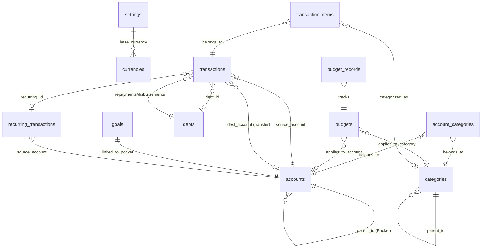

# Database Architecture & Core Business Logic

> Dompet extends the upstream Poka CE schema with a local transaction-detection pipeline
> (`transaction_detections`, `merchant_category_rules`, `salary_profiles`, schema v2).

> [!IMPORTANT]
> **DATABASE RULES:**
> ALL `Enum` values (e.g., `type`, `status`, `role`) **MUST** be stored in lowercase in the database (e.g., `income`,
`expense`, `transfer`, `active`, `synced`). Uppercase or CamelCase is prohibited in the database.

Blueprint of the database structure and core business logic for the Dompet application.

## Entity-Relationship Diagram (ERD)

## 0. Currencies

Master catalog holding standard currency information. Dompet operates as **Single Currency**. The user selects 1
currency during Onboarding, stored permanently in the `settings` table.

- **`currencies` Table:** `id` (UUIDv7), `name`, `code` (ISO 4217), `symbol`, `precision`, timestamps.
- **`settings` Table:** `key` (e.g., `base_currency`), `value` (e.g., "IDR"), timestamp.

## 1. Categories

Groups transaction types. Supports sub-categories by referencing itself.

- **`categories` Table:** `id` (UUIDv7), `name`, `icon`, `color`, `parent_id`, `type` (income/expense), `sort`,
  `is_active`
  (soft-delete), timestamps.

## 2. Accounts & Pocket

Acts as wallets or bank accounts. Supports **Pockets** (sub-wallets inside a main wallet) by linking to a parent
account.

- **`accounts` Table:** `id` (UUIDv7), `name`, `icon`, `color`, `type` (Assets/Liability/Goal), `balance` (Integer,
  smallest unit), `initial_balance` (Integer), `parent_id` (Pocket link), `is_active`, `sort`, timestamps.
- **`account_categories` Table (Category Restrictions):** Restricts which categories appear for specific wallets.

> [!NOTE]
> **Balance & Category Logic:**
> - **Total Balance:** Parent Account Balance = its own balance + sum of all its Pockets' balances.
> - **Initial Balance:** Initial balance is stored in the `initial_balance` column. The `balance` column represents the
    current calculated balance (initial_balance + all income - all expenses). There is no need to generate a fake
    "Initial Balance" transaction.
> - **Category Inheritance:** Pockets inherit category restrictions from their Parent if they don't have their own.
> - **Sub-Category Flattening:** When restricting categories in UI, child categories must be inserted explicitly to
    maintain O (1) query performance.

## 3. Budgeting

Defines maximum spending limits for specific periods.

- **`budgets` Table:** `id` (UUIDv7), `name`, `amount`, `category_id` (nullable), `account_id` (nullable), `period`
  (monthly/weekly/yearly/custom), `reset_day`, `alert_threshold`, `start_date`, `end_date`, timestamps.
- **`budget_records` Table:** Tracks actual progress for a specific cycle. `spent_amount` (Integer).

> [!NOTE]
> **Budget Logic:**
> - **Rollover:** Unused budget quotas expire at the end of the month; they do NOT carry over.
> - **Visual UI:** Budget colors and icons automatically inherit from the bound `category` or `account`.
> - **Accurate Deduction:** Budget progress is deducted based on item details from `transaction_items`, NOT the
    `transactions` header total. This ensures mixed receipts deduct from their respective budgets accurately.

## 4. Transactions

The heart of the app. Uses a **Header-Item (Parent-Child)** architecture to accommodate "Split Transactions" (single
receipt with multiple items of different categories).

- **Header `transactions` Table (Physical Receipt):** `id` (UUIDv7), `account_id`, `destination_account_id` (for
  transfers), `type` (income/expense/transfer), `amount` (total receipt price), `transaction_date`, `note`,
  `recurring_transaction_id`, `debt_id`, timestamps.
- **Detail `transaction_items` Table (Receipt Line Items):** `id`, `transaction_id`, `category_id`, `allocation`,
  `amount`, `note`, timestamps. (Minimum 1 item per transaction).

> [!IMPORTANT]
> **Transaction Logic:**
> - **Real-time Balance Mutations:**
>   - `income` ADDS to `account_id`.
      >   - `expense` SUBTRACTS from `account_id`.
      >   - `transfer` SUBTRACTS from `account_id` & ADDS to `destination_account_id`. Transfer admin fees must be
      recorded separately as manual `expense` transactions.
> - **Sync Total:** The sum of all `amount` values in `transaction_items` MUST exactly equal the `amount` in the Header
    table.
> - **Hard-Delete & Reversal:** No soft-delete for transactions. Deleting a transaction destroys it permanently.
    **Before destruction**, the system MUST reverse the balance mutation and revert the deduction in `budget_records`.

## 5. Goals

Feature for disciplined saving targets.

- **`goals` Table:** `id` (UUIDv7), `account_id` (Unique, linked Pocket), `name`, `target_amount`, `target_date`,
  `icon`, `color`, `status`, timestamps.

> [!NOTE]
> **Goal Logic:**
> - **Auto-Generate Pocket:** Creating a new Goal silently creates **1 new Pocket account** (`type` = `Goal`) and links
    it.
> - **Saving (Deposit):** Users record a `transfer` transaction from their main account to this Goal Pocket.
> - **Auto Progress:** Progress is taken raw from the linked Pocket's `balance`.

## 6. Recurring Transactions

Blueprints for automatic bills (e.g., installments, subscriptions).

- **`recurring_transactions` Table:** `id` (UUIDv7), `account_id`, `destination_account_id`, `category_id`,
  `allocation`, `type`,
  `amount`, `note`, `period`, `next_date`, `is_active`, timestamps.

> [!NOTE]
> **Automation Logic:**
> - On app startup (or via Cron), the system checks for active bills where `next_date` <= today.
> - If found, it creates a **real transaction** in `transactions` & `transaction_items`, links it via
    `recurring_transaction_id`, and shifts `next_date` forward.

## 7. Debts / Loans

Tracks inter-personal cash flows separately but integrated with wallet balances.

- **`debts` Table:** `id` (UUIDv7), `person_name`, `type` (`debt` = we borrowed, `loan` = we lent), `amount`,
  `remaining_amount`, `status` (active/paid), `due_date`, `note`, timestamps.

> [!NOTE]
> **Debt Logic:**
> - **Cash Flow Binding:** Debts MUST be accompanied by physical transactions.
>   - Creating a **Debt** automatically prints an `income` transaction in the wallet.
      >   - Creating a **Loan** automatically prints an `expense` transaction in the wallet.
> - **Repayment:** When an installment is paid/received, the system records it as an `expense`/`income` in the wallet,
    fills the `debt_id`, and deducts the value from `remaining_amount`.
