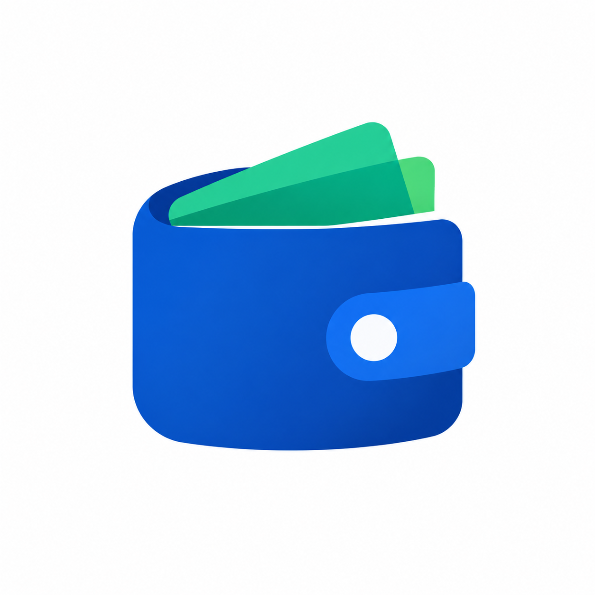

<p align="center">
  
</p>

<h1 align="center">Dompet</h1>
<p align="center"><i>Dompet — Personal finance, private by design.</i></p>

<p align="center">
  <a href="https://github.com/robprian/dompet/actions/workflows/ci.yml">
    
  </a>
  <a href="https://github.com/robprian/dompet/blob/main/LICENSE">
    
  </a>
  <a href="https://flutter.dev">
    
  </a>
</p>

<p align="center">
  &nbsp;&nbsp;
  &nbsp;&nbsp;
  
</p>

<details>
  <summary><b>More screenshots</b></summary>
  <br/>

|                                       Home                                       |                                Home (Dark)                                |                               Transactions                                |                              Transactions (Dark)                               |
|:--------------------------------------------------------------------------------:|:-------------------------------------------------------------------------:|:-------------------------------------------------------------------------:|:------------------------------------------------------------------------------:|
|                 |     |  |  |
|                                 **Expense Form**                                 |                            **Expense (Dark)**                             |                                **Reports**                                |                                  **Budgets**                                   |
|  |  |       |            |

</details>

---

## About Dompet

Dompet is an offline-first personal finance tracker with one core principle: **your financial data belongs to you, and
only you.** There is no account to create, no server to sync with, and no subscription to manage. Every transaction,
balance, and record lives exclusively in a local SQLite database on your device.

Dompet automatically detects transactions from Indonesian bank, e-wallet, and QRIS notifications — entirely on-device —
and pairs them with a local financial advisor that suggests salary allocations, flags overspending, and watches your
budgets. No notification content, transaction, or insight ever leaves your phone.

> [!WARNING]
> **Active development.** Core features are ready for use, but edge cases are still being refined. We strongly
> recommend backing up your data regularly via **Settings → Backup**.

---

## Key Features

- **Multi-Account Management** — Track multiple accounts simultaneously with real-time balance updates.
- **Income, Expense & Transfer** — Record all transaction types with full history and filtering.
- **Automatic Transaction Detection** — Reads Android bank/e-wallet/QRIS notifications locally (with your explicit
  permission) and proposes transaction candidates with confidence scoring, duplicate detection, and a review queue.
- **Salary Detection** — Recognizes recurring salary payments using keywords and historical patterns, then suggests a
  configurable allocation plan.
- **Dompet Advisor** — A 100% offline recommendation engine: budget alerts, overspending detection, large-transaction
  notices, savings-rate guidance, and local notifications. No cloud AI involved.
- **Budgeting** — Set monthly spending limits per category and monitor adherence.
- **Goals** — Define saving targets and visualize progress over time.
- **Debt & Loan Tracking** — Log amounts owed or lent, with paired transaction records.
- **Split Transactions** — Allocate a single transaction across multiple categories or pockets.
- **Smart Input Parsing** — Type math expressions directly into the amount field (e.g., `150000+50000*2`); the
  calculator evaluates them in real time.
- **Offline First** — 100% local SQLite storage via Drift. No internet required, ever.
- **Flat Design System** — Built with [ForUI](https://github.com/forui-dev/forui); no shadows, no elevation — clean and
  sharp.

---

## Privacy Architecture

- Financial data is stored only in a local SQLite database (`dompet.sqlite`).
- Bank/QRIS notifications are parsed in memory; raw notification text is never persisted, logged, or transmitted.
- The advisor runs deterministic local rules — there is no OpenAI/Gemini/Claude integration and no analytics SDK.
- Backups are AES-GCM encrypted files that you control.

---

## Tech Stack

- **Framework**: [Flutter](https://flutter.dev/) & Dart
- **Database**: [Drift](https://drift.simonbinder.eu/) (SQLite, local-only)
- **State Management**: [Riverpod](https://riverpod.dev/) with `riverpod_generator`
- **UI & Design System**: [ForUI](https://github.com/forui-dev/forui)
- **Routing**: [GoRouter](https://pub.dev/packages/go_router) with `go_router_builder`
- **Localization**: [Slang](https://pub.dev/packages/slang)
- **Code
  Generation**: [Freezed](https://pub.dev/packages/freezed), [build_runner](https://pub.dev/packages/build_runner)

---

## Download & Install

Download the latest release directly from the [GitHub Releases page](https://github.com/robprian/dompet/releases).
Each release ships a `Dompet-vX.Y.Z.apk` built by GitHub Actions, plus a `.sha256` checksum.

**System Requirements:**

- **OS**: Android 5.0 (Lollipop) or newer (API level 21+)
- **Storage**: ~30 MB free space (if using Split APK)
- **Internet**: Not required — Dompet is 100% offline.

**Which APK should I choose?**

- `app-arm64-v8a-release.apk` **(Recommended)**: Almost all modern Android phones (2016 and newer).
- `app-armeabi-v7a-release.apk`: Older 32-bit Android devices.
- `app-universal-release.apk`: Works on all devices, but larger in size. Use this if you are unsure or if the others
  fail to install.

---

## Quickstart

### Prerequisites

- Flutter SDK **3.47.2** or newer
- Dart SDK **3.13.2** or newer

### Steps

**1. Clone the repository:**

```bash
git clone https://github.com/robprian/dompet.git
cd dompet
```

**2. Install dependencies:**

```bash
flutter pub get
```

**3. Set up environment and generate code:**

```bash
cp .env.example .env
make generate
```

> The `.env` file is required for local runs. Set `DOMPET_SEED_DUMMY_DATA=true` to populate the database with seed
> data for development. If you don't have Make, run `dart run build_runner build` instead.

**4. Run the application:**

```bash
flutter run --dart-define-from-file=.env
```

> For the full contribution workflow, testing setup, watch mode code generation, and database migration guide —
> see [CONTRIBUTING.md](CONTRIBUTING.md).

---

## Attribution

Dompet is built on top of the open-source [Poka CE](https://github.com/getpoka/poka-ce) codebase by Octopy ID,
licensed under the Apache License 2.0. See [LICENSE](LICENSE) for the full license text. Dompet is an independent
project and does not imply official affiliation with Poka/GetPoka.

The Apache 2.0 license covers the code — it does **not** grant rights to the **Poka**, **GetPoka**, or **Octopy ID**
brand identities. Read the upstream policy: [TRADEMARK.md](TRADEMARK.md).

---

## Security & Privacy

Dompet uses an **offline-first, local-only architecture**. All financial data is stored in a SQLite database on the
user's device. No data is transmitted to any server, and no analytics or telemetry is collected.

**Reporting a Vulnerability:** If you discover a security issue, please follow the responsible disclosure process
described in [SECURITY.md](SECURITY.md). Do not open a public GitHub issue for security vulnerabilities.

---

## Contributing

Contributions are welcome — bug reports, feature discussions, and pull requests alike. If you are new to the codebase,
look for issues labeled `good first issue` as a starting point.

Before submitting a pull request, please read [CONTRIBUTING.md](CONTRIBUTING.md). It covers the architecture
constraints, code style, commit conventions, branch workflow, and the PR review process.

---

## License

Dompet is licensed under the **Apache License 2.0**. See [LICENSE](LICENSE) for the full license text.
